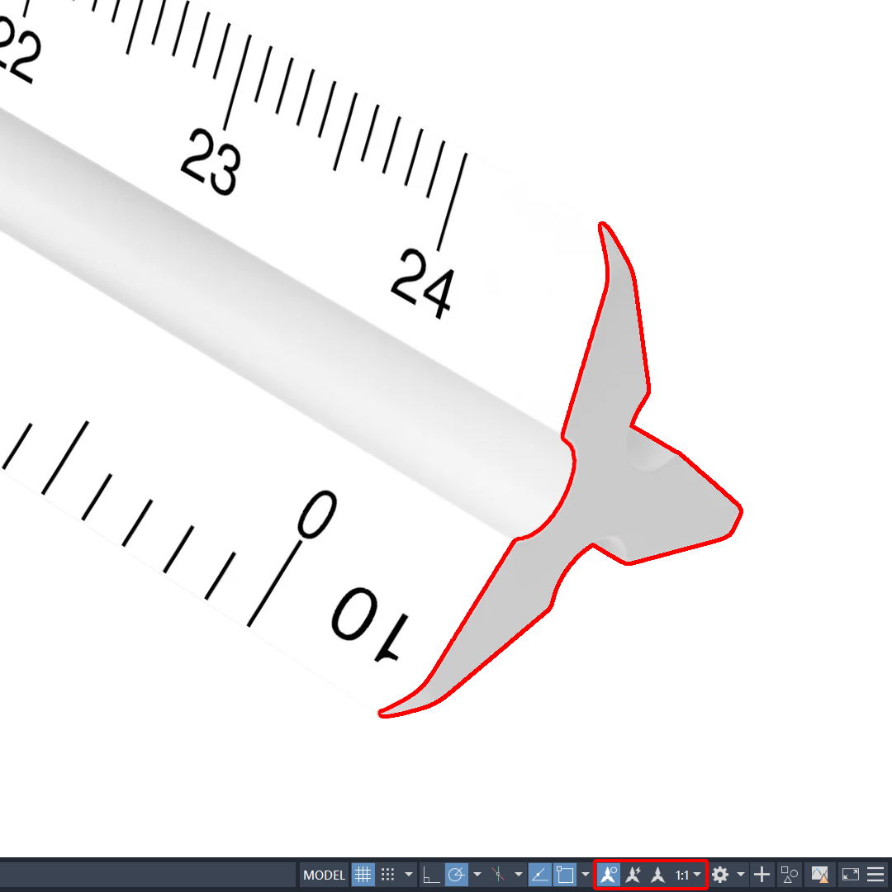

# Drafting Scale Clock

- Download from Printables here: [`Download Link`](https://www.printables.com/model/1691516-triangular-scale-clock)
- Download from Thingiverse here: [`Download Link`](https://www.thingiverse.com/thing:7336565)

## Summary

A clock in the profile of a triangular drafting scale!

* * *

# Summary

A clock in the profile of a triangular drafting scale!

- **What's Included:**
    - Clock body
    - Six printable clock faces

# Print Settings

- Supports: Support on build plate only
- Infill: 5%
- Brim: true

# Bill of Materials

- One clock movement mechanism with hands
- One wall hanging kit with hooks or nails
- Battery for clock movement mechanism
- US Letter or A4 size cardstock paper

# Assembly

- **Assembling the clock body and face**
	- Print `clock-faces.pdf` and cut your preferred clock face along the outermost solid line.
	- Use double-sided tape on the blank side of the printed clock face and apply it to the clock body.

- **Assembling the clock movement mechanism**
	- Slide rubber washer to shaft base of clock movement mechanism.
	- Insert clock movement shaft through central hole of clock.
	- Slide brass washer over shaft.
	- Screw hex nut onto shaft. Do not overtighten.
	- Slide hour hand onto shaft, and press down until it stops.
	- Align minute hand over shaft, and press down until it stops.
	- Screw cap nut onto shaft. Do not overtighten.
	- Insert battery into clock movement mechanism.
	- Use the dial on the back to set time.

# Additional Information

- **Notes**
    - Six faces are included with the model and are in the PDF format. This can be cut by hand or more accurately on a machine like the [Cricut](https://cricut.com/en_us).
    - General clock movement assembly instructions are provided for your convenience. Instructions will vary based on the clock manufacturer.

* * *

# Previews

